# Design

## About

- For Creater

  - Register Schedule and Information.

- For Viewer (listener)

  - Display Schedules and Information of various YouTubers at once.

## Display

### Creater

- ToBe...

- Considering the Following Registration.

  - Call WebAPI

  - Catch Events from Discord

  - Analyze from YouTube

### Viewer

- List: Display the Status of Each Channel by Date.

- Grid: Displays the status of Each Channel in a Grid by Time.

  - Select Stream: Show Details.

- Detail: Display Schedule for Each Channel.
